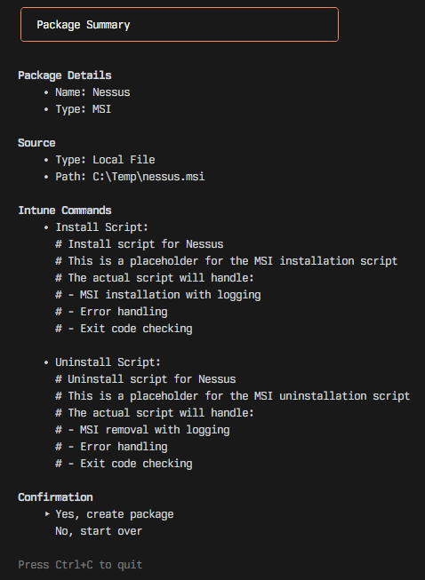

# Nexus

Automated tool for monitoring, packaging, and versioning Intune applications. Streamlines the process of detecting new software versions, repackaging applications, and managing deployments through Microsoft Intune.

> Currently a work in progress.

## Screenshots

